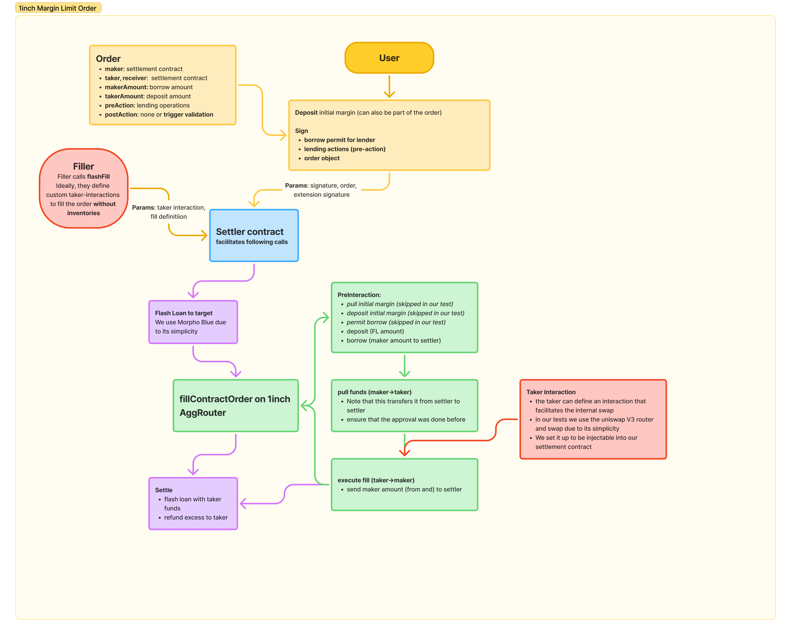

# 1delta Unite

A Limit Order extension for the 1inhc protocol that allows using the orders for defi spot margin trading an lenders like Aave and Morpho Blue.

## Limit orders for basis trading using 1inch

Execute pre-action as composed lending operations.

100% Gasless possible for users.

Partial fils possibly included.

Many lenders supported (Aave, Morpho and Compounds).

Triggers possible in `postInteraction`.

## Contract architecture



### ✨ Execution flow

1) the user defines the order and lending operations (borrow and deposit in our examples)
2) setup for the user
   - they can decide to deposit the initial margin upfront, but it can also be part of the `preInteraction` (they would then only need to permit the deposit action)
   - the borrow delegation needs to be provided (either via `permit` (then it is in the `preInteraction`) or via simple `approveDelegation` call)
3) the order and extension action need to be signed (this can be abbreviated, but for simplicity we do it with 2 signatures)
4) the order and extension can be broadcast to fillers
5) **Fill**: A filler can pick it up and define a `takerInteraction` to fill the order
   - our settler will flash loan the funds (the `takerAount`) from morpho to the settler itself and call teh 1inch `fillContractOrder` function
   - beforehand, we extract the signer from the lending operation to validate the signature (we need this to ensure that the correct entity recevies the collateral and debt)
   - we call teh 1inch contract and it execute the `isValidSignature` function
   - the sttlement contract works as contract signer for users (for this cas e only) as it combines signature and expected signer (the signer from the lending operations) to be forwarded for validation
   - the settler extracts the signer from the signature and matches it
   - **Margin**: `preInteraction` is called, in our examples, this is deposit the `takingAmount` (here we need the flash loaned funds as the taker has not yet transferred anything), then borrow the `makingAmount`
   - note that the interaction now produced  the making amount without the user holding them
   - **Maker->Taker** the 1inch router can now pull the funds to fill the maker to taker transfer
   - **Taker fill without inventory**: `takerInteraction` is executed that swaps the received funds (via uniswap V3 in our case) to obtain the `takerAmount` that is pending for flash loan repayment
   - **Maker->Taker**: After the filfilment, the 1inch router executes the final token transfer that ensures that the funds indeed were received
   - **Flash settlement**: the amounts received are validated and we refund the excess (amount received from uni V3 minus falsh-repayment amount to the taker defined address) and repay the flash loan
6) The user now holds a leveraged position in Aave V3 that has bee conditionally opened and the filler fulfilled that order without holding inventory.


## Execute tests
We added full tests for the flow from the deposit of the initial margin, permissioning until the filli ng with uniswap V3.

They can be run via the following commands:

 ```bash
 cd contracts
 forge test --match-test test_flash_fill -vvvv ## vebosity is to show all events (aave operations, 1inch limit order fill)
 ```

Asserts at the end ensure that teh correct balances were created for the user.


# Resources

## 1delta contracts for lending
- we derived our aave and morpho lending operations from [1delta contracts](https://github.com/1delta-DAO/contracts-delegation/tree/main/contracts/1delta/composer/lending) 
- we changed them to have dynamic (not within calldata) amount definitions to link them with the filling amounts
- we also added the permits (which are not used in our tests) which enable pulling (and borrowing) the funds from the user in a gasless manner

All other parts have been written from scratch (`MarginSettlement`, `ContractSigner` and tests)
